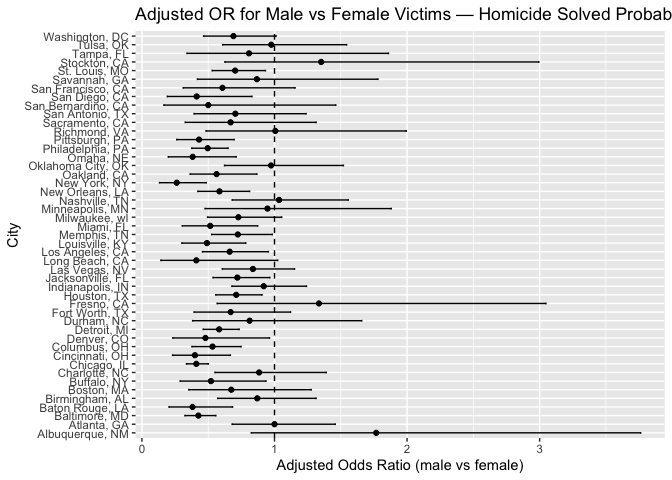
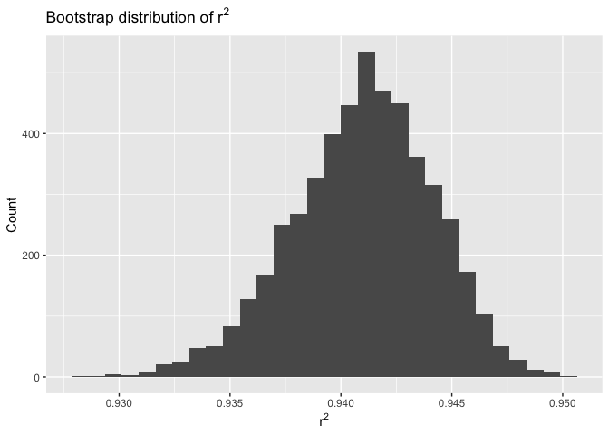
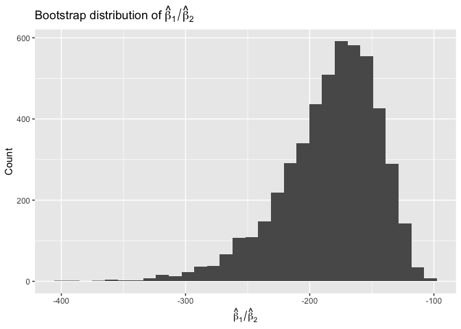
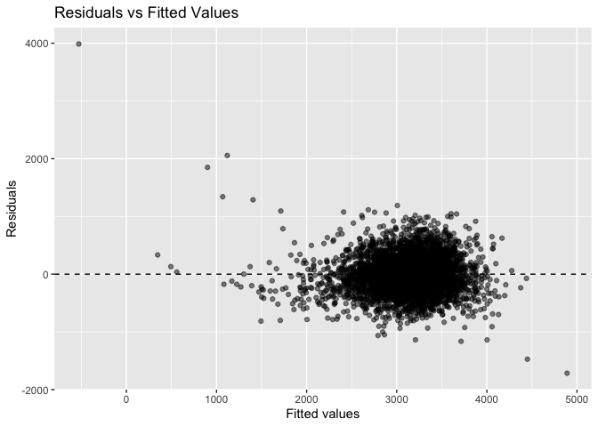
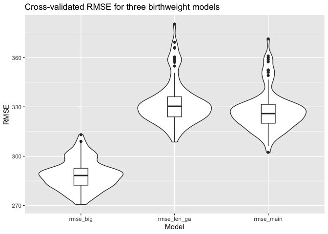

p8105_hw6_sc5558
================
Shiyun Angel Cheng
2025-12-02

Import Necessary Libraries

``` r
library(tidyverse)
```

    ## ── Attaching core tidyverse packages ──────────────────────── tidyverse 2.0.0 ──
    ## ✔ dplyr     1.1.4     ✔ readr     2.1.5
    ## ✔ forcats   1.0.0     ✔ stringr   1.5.1
    ## ✔ ggplot2   3.5.2     ✔ tibble    3.3.0
    ## ✔ lubridate 1.9.4     ✔ tidyr     1.3.1
    ## ✔ purrr     1.1.0     
    ## ── Conflicts ────────────────────────────────────────── tidyverse_conflicts() ──
    ## ✖ dplyr::filter() masks stats::filter()
    ## ✖ dplyr::lag()    masks stats::lag()
    ## ℹ Use the conflicted package (<http://conflicted.r-lib.org/>) to force all conflicts to become errors

``` r
library(broom)
library(p8105.datasets)
library(modelr)
```

    ## 
    ## Attaching package: 'modelr'
    ## 
    ## The following object is masked from 'package:broom':
    ## 
    ##     bootstrap

``` r
library(purrr)
```

## Problem 1

``` r
#Load and Clean Data
homicides = read_csv("data/homicide-data.csv") |>
  mutate(
    city_state = str_c(city, ", ", state),
    solved = case_when(
      disposition == "Closed by arrest" ~ 1,
      TRUE ~ 0
    ),
    victim_age = as.numeric(victim_age)
  ) |>
  filter(
    !(city_state %in% c("Dallas, TX", "Phoenix, AZ", "Kansas City, MO")),
    city_state != "Tulsa, AL",
    victim_race %in% c("White", "Black")
  )
```

    ## Rows: 52179 Columns: 12
    ## ── Column specification ────────────────────────────────────────────────────────
    ## Delimiter: ","
    ## chr (9): uid, victim_last, victim_first, victim_race, victim_age, victim_sex...
    ## dbl (3): reported_date, lat, lon
    ## 
    ## ℹ Use `spec()` to retrieve the full column specification for this data.
    ## ℹ Specify the column types or set `show_col_types = FALSE` to quiet this message.

    ## Warning: There was 1 warning in `mutate()`.
    ## ℹ In argument: `victim_age = as.numeric(victim_age)`.
    ## Caused by warning:
    ## ! NAs introduced by coercion

Logistic Regression - Baltimore, MD

``` r
baltimore_df = homicides |> filter(city_state == "Baltimore, MD")

baltimore_fit = glm(
  solved ~ victim_age + victim_sex + victim_race,
  family = binomial,
  data = baltimore_df
)

baltimore_results =
  tidy(baltimore_fit, conf.int = TRUE, exponentiate = TRUE)

baltimore_results
```

    ## # A tibble: 4 × 7
    ##   term             estimate std.error statistic  p.value conf.low conf.high
    ##   <chr>               <dbl>     <dbl>     <dbl>    <dbl>    <dbl>     <dbl>
    ## 1 (Intercept)         1.36    0.171        1.81 7.04e- 2    0.976     1.91 
    ## 2 victim_age          0.993   0.00332     -2.02 4.30e- 2    0.987     1.000
    ## 3 victim_sexMale      0.426   0.138       -6.18 6.26e-10    0.324     0.558
    ## 4 victim_raceWhite    2.32    0.175        4.82 1.45e- 6    1.65      3.28

Extract adjusted OR

``` r
baltimore_or =
  baltimore_results |> 
  filter(term == "victim_sexMale") |> 
  select(estimate, conf.low, conf.high)
```

Fit Models for ALL Cities

``` r
city_results = 
  homicides |>
  group_by(city_state) |>
  nest() |>
  mutate(
    model = map(data, ~ glm(
      solved ~ victim_age + victim_sex + victim_race,
      family = binomial,
      data = .x
    )),
    tidy_model = map(model, ~ tidy(.x, conf.int = TRUE, exponentiate = TRUE))
  ) |>
  unnest(tidy_model) |>
  filter(term == "victim_sexMale")
```

    ## Warning: There were 43 warnings in `mutate()`.
    ## The first warning was:
    ## ℹ In argument: `tidy_model = map(model, ~tidy(.x, conf.int = TRUE, exponentiate
    ##   = TRUE))`.
    ## ℹ In group 1: `city_state = "Albuquerque, NM"`.
    ## Caused by warning:
    ## ! glm.fit: fitted probabilities numerically 0 or 1 occurred
    ## ℹ Run `dplyr::last_dplyr_warnings()` to see the 42 remaining warnings.

Plot Adjusted ORs by City

``` r
city_results |>
  mutate(city_state = fct_reorder(city_state, estimate)) |>
  ggplot(aes(x = estimate, y = city_state)) +
  geom_point() +
  geom_errorbar(aes(xmin = conf.low, xmax = conf.high), width = 0.2) +
  geom_vline(xintercept = 1, linetype = "dashed") +
  labs(
    x = "Adjusted Odds Ratio (male vs female)",
    y = "City",
    title = "Adjusted OR for Male vs Female Victims — Homicide Solved Probability"
  )
```

<!-- -->
Text Comment: Cities vary widely in the adjusted odds of a homicide
being solved for male versus female victims. Several cities have OR
estimates above 1, indicating that homicides of male victims are more
likely to be solved relative to female victims, while others have ORs
below 1, showing the opposite pattern. Confidence intervals are often
wide, reflecting small sample sizes. Cities with narrower CIs tend to
have larger homicide counts and more stable estimates. \## Problem 2

Load Data

``` r
data("weather_df")
weather_df = 
  weather_df |>
  drop_na(tmax, tmin, prcp)
```

Fit the regression we’re boostrapping around:

``` r
orig_fit = lm(tmax ~ tmin + prcp, data = weather_df)

glance(orig_fit)    # contains r.squared
```

    ## # A tibble: 1 × 12
    ##   r.squared adj.r.squared sigma statistic p.value    df logLik    AIC    BIC
    ##       <dbl>         <dbl> <dbl>     <dbl>   <dbl> <dbl>  <dbl>  <dbl>  <dbl>
    ## 1     0.941         0.941  2.73    17245.       0     2 -5259. 10526. 10549.
    ## # ℹ 3 more variables: deviance <dbl>, df.residual <int>, nobs <int>

``` r
tidy(orig_fit)      # contains coefficients, including beta1 / beta2
```

    ## # A tibble: 3 × 5
    ##   term        estimate std.error statistic  p.value
    ##   <chr>          <dbl>     <dbl>     <dbl>    <dbl>
    ## 1 (Intercept)  7.78     0.0854       91.0  0       
    ## 2 tmin         1.02     0.00558     182.   0       
    ## 3 prcp        -0.00558  0.000593     -9.41 1.21e-20

Define a function to do one bootstrap replicate

``` r
boot_once = function(df) {
  
  boot_sample = df |> 
    slice_sample(prop = 1, replace = TRUE)
  
  fit = lm(tmax ~ tmin + prcp, data = boot_sample)
  
  g = glance(fit)
  t = tidy(fit)
  
  r2 = g$r.squared
  
  beta1 = t$estimate[t$term == "tmin"]
  beta2 = t$estimate[t$term == "prcp"]
  
  tibble(
    r2 = r2,
    beta_ratio = beta1 / beta2
  )
}
```

Run 5000 bootstrap samples

``` r
set.seed(8105)

boot_results = 
  tibble(rep = 1:5000) |>
  mutate(
    estimates = map(rep, ~ boot_once(weather_df))
  ) |>
  unnest(estimates)
```

Distribution of r^2

``` r
boot_results |>
  ggplot(aes(x = r2)) +
  geom_histogram(bins = 30) +
  labs(
    x = expression(r^2),
    y = "Count",
    title = expression("Bootstrap distribution of " * r^2)
  )
```

<!-- -->
Distribution of beta 1 hat/beta 2 hat

``` r
boot_results |>
  ggplot(aes(x = beta_ratio)) +
  geom_histogram(bins = 30) +
  labs(
    x = expression(hat(beta)[1] / hat(beta)[2]),
    y = "Count",
    title = expression("Bootstrap distribution of " * hat(beta)[1] / hat(beta)[2])
  )
```

<!-- -->
Comment: The bootstrap distribution of r^2 is fairly concentrated,
suggesting that model fit is reasonable stable across resamples. 95%
bootstrap Cls using quantiles

``` r
ci_summary = 
  boot_results |>
  summarize(
    r2_lo = quantile(r2, 0.025),
    r2_hi = quantile(r2, 0.975),
    ratio_lo = quantile(beta_ratio, 0.025),
    ratio_hi = quantile(beta_ratio, 0.975)
  )

ci_summary
```

    ## # A tibble: 1 × 4
    ##   r2_lo r2_hi ratio_lo ratio_hi
    ##   <dbl> <dbl>    <dbl>    <dbl>
    ## 1 0.934 0.947    -277.    -125.

## Problem 3

``` r
#load and clean data 
birthweight =
  read_csv("data/birthweight.csv") |>
  janitor::clean_names() |>
  mutate(
    babysex = factor(babysex, labels = c("male", "female")),
    frace = factor(frace),
    mrace = factor(mrace),
    malform = factor(malform, labels = c("absent", "present")),
    # mother's smoking could be numeric; leave as numeric since it's continuous
  ) |>
  drop_na()
```

    ## Rows: 4342 Columns: 20
    ## ── Column specification ────────────────────────────────────────────────────────
    ## Delimiter: ","
    ## dbl (20): babysex, bhead, blength, bwt, delwt, fincome, frace, gaweeks, malf...
    ## 
    ## ℹ Use `spec()` to retrieve the full column specification for this data.
    ## ℹ Specify the column types or set `show_col_types = FALSE` to quiet this message.

``` r
# propose a regression model fro birthweight
mod_main =
  lm(bwt ~ babysex + blength + gaweeks + momage +
        mheight + ppbmi + smoken,
     data = birthweight)
```

Residual plot using add_predictions and add_residuals

``` r
birthweight_with_preds =
  birthweight |>
  add_predictions(mod_main) |>
  add_residuals(mod_main)

birthweight_with_preds |>
  ggplot(aes(x = pred, y = resid)) +
  geom_point(alpha = 0.5) +
  geom_hline(yintercept = 0, linetype = "dashed") +
  labs(
    x = "Fitted values",
    y = "Residuals",
    title = "Residuals vs Fitted Values"
  )
```

<!-- -->
The residuals show no strong nonlinear pattern, though variance
increases slightly at higher fitted birthweights. Overall, the model
appears reasonably well-behaved with no severe violations.

Comparison Model 1: Length + gestational age (main effects only)

``` r
mod_len_ga =
  lm(bwt ~ blength + gaweeks, data = birthweight)
```

Comparison Model 2: Head circumference, length, sex, and all
interactions (including 3-way)

``` r
mod_big =
  lm(bwt ~ (bhead + blength + babysex)^3, data = birthweight)
```

Cross-validated prediction error using cross_mc

``` r
cv_df =
  crossv_mc(birthweight, 100) |>
  mutate(
    train = map(train, as_tibble),
    test = map(test, as_tibble),
    mod_main = map(train, ~ lm(bwt ~ babysex + blength + gaweeks +
                                      momage + mheight + ppbmi + smoken, data = .x)),
    mod_len_ga = map(train, ~ lm(bwt ~ blength + gaweeks, data = .x)),
    mod_big = map(train, ~ lm(bwt ~ (bhead + blength + babysex)^3, data = .x)),
    rmse_main = map2_dbl(mod_main, test, ~ rmse(.x, .y)),
    rmse_len_ga = map2_dbl(mod_len_ga, test, ~ rmse(.x, .y)),
    rmse_big = map2_dbl(mod_big, test, ~ rmse(.x, .y))
  )
```

Summarize RMSE for each model

``` r
cv_df |>
  select(starts_with("rmse")) |>
  pivot_longer(everything(), names_to = "model", values_to = "rmse") |>
  ggplot(aes(x = model, y = rmse)) +
  geom_violin() +
  geom_boxplot(width = 0.15, fill = "white") +
  labs(title = "Cross-validated RMSE for three birthweight models",
       x = "Model",
       y = "RMSE")
```

<!-- -->
Interpretation:
